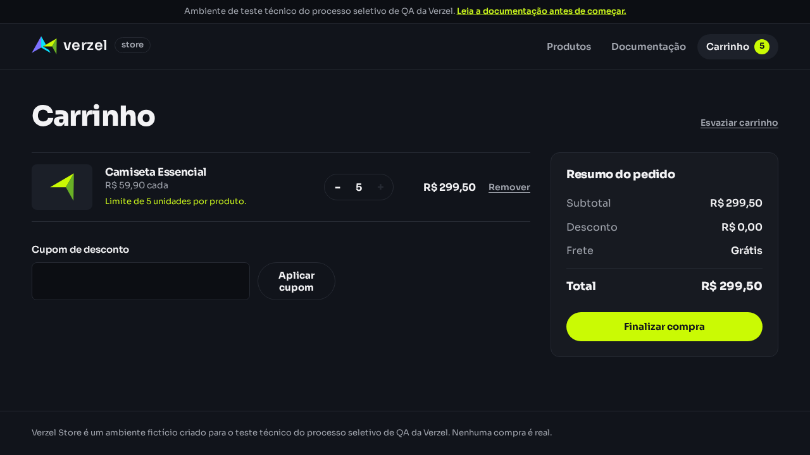
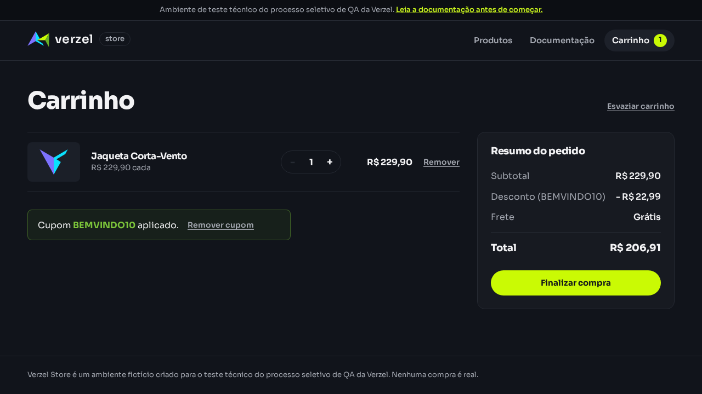
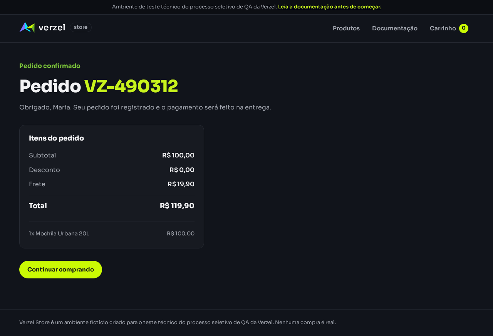
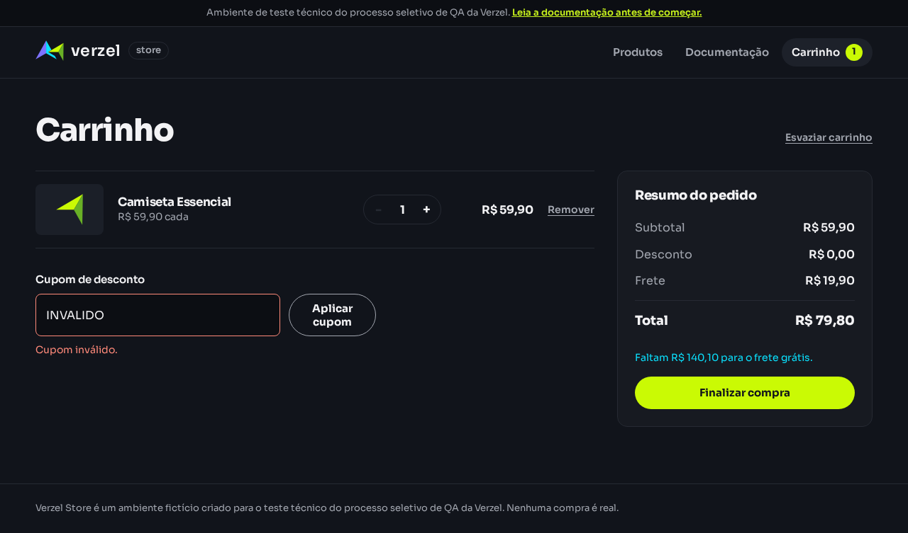
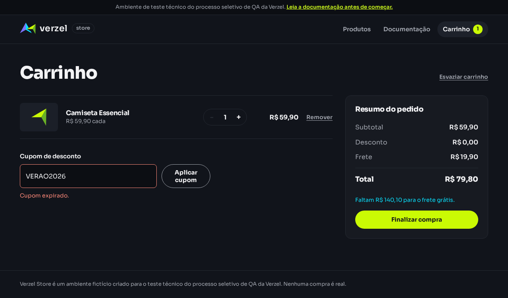
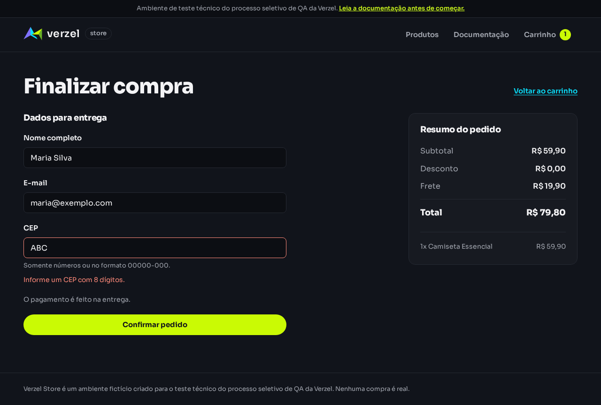

# Verzel Store — QA Technical Test

## Sobre

Este repositório reúne a documentação, os cenários, os testes manuais, os testes exploratórios e a automação do desafio técnico de QA Júnior da Verzel Store.

## Objetivo

Validar a aplicação contra a documentação oficial, mapear regras de negócio e automatizar cenários de alto valor com Playwright, sem ignorar as simplificações intencionais do ambiente compartilhado.

## Stack

- Playwright
- TypeScript
- Gherkin
- Git
- Markdown

## Como executar

### Instalação

```bash
npm install
npx playwright install
```

> Em ambientes WSL/Ubuntu, pode ser necessário instalar as dependências do sistema do Chromium caso o navegador não inicialize.

### Testes

```bash
npx playwright test
```

### Relatório

```bash
npx playwright show-report
```

### Integração contínua

O GitHub Actions executa os testes Playwright em pushes e pull requests. O workflow instala o Chromium e publica o relatório HTML e os resultados como artefato, inclusive quando algum teste falha. As regressões que reproduzem BUG-001, BUG-002 e BUG-003 mantêm a execução com falha até que os defeitos sejam corrigidos.

## Estrutura do repositório

- [docs/requisitos.md](docs/requisitos.md) — requisitos, regras e validações.
- [docs/contexto-projeto.md](docs/contexto-projeto.md) — contexto consolidado para continuidade do projeto.
- [docs/api.md](docs/api.md) — endpoints e regras da API.
- [docs/test-matrix.md](docs/test-matrix.md) — matriz de teste.
- [docs/testes-detalhados.md](docs/testes-detalhados.md) — testes detalhados com resultados completos.
- [results/full-regression.md](results/full-regression.md) — execução manual e exploratória da UI e API, com resultado por cenário.
- [docs/exploratory-testing.md](docs/exploratory-testing.md) — testes exploratórios.
- [docs/ambiguities.md](docs/ambiguities.md) — ambiguidades e decisões.
- [features/](features/) — cenários em Gherkin.
- [results/manual-tests.md](results/manual-tests.md) — execução dos testes manuais.
- [bugs/](bugs/) — relatório de problemas e observações.
- [evidence/](evidence/) — registros de evidência por cenário.
- [tests/](tests/) — automação Playwright.

## Cenários

- Catálogo de produtos
- Carrinho de compras
- Cupom de desconto
- Frete grátis
- Checkout

## Resultados dos testes da API

Os cenários são executados contra o ambiente externo com `npx playwright test tests/api.spec.ts`. “Correto” significa que o retorno observado corresponde ao contrato documentado; um teste de rejeição também pode estar correto quando a requisição inválida recebe o status e o código de erro esperados.

### Retornos corretos

| Endpoint/cenário | Retorno observado | Avaliação |
|---|---|---|
| `GET /api/produtos` | HTTP 200; lista os oito produtos P001–P008 com nomes, descrições, categorias e preços documentados. | Correto |
| `GET /api/produtos/P001` | HTTP 200; retorna os dados da Camiseta Essencial. | Correto |
| `GET /api/produtos/NOPE` | HTTP 404; `PRODUTO_NAO_ENCONTRADO`. | Correto |
| `POST /api/carrinho/calcular` com P002 ×1, P004 ×2 e `BEMVINDO10` | HTTP 200; subtotal R$ 239,70, desconto R$ 23,97, frete R$ 0,00 e total R$ 215,73. | Correto |
| Cálculo com subtotal R$ 199,90 | HTTP 200; frete R$ 19,90 e R$ 0,10 faltante para frete grátis. | Correto |
| Cálculo com subtotal R$ 209,90 | HTTP 200; frete grátis e total R$ 209,90. | Correto |
| Cupom `  bemvindo10  ` no cálculo | HTTP 200; normaliza caixa e espaços externos, aplica 10% de desconto. | Correto |
| Cupom inválido ou expirado no cálculo | HTTP 200; desconto zero, `aplicado: false` e mensagem `Cupom inválido.` ou `Cupom expirado.`. | Correto |
| Cálculo de P001 ×3 com cupom válido | HTTP 200; subtotal R$ 179,70, desconto R$ 17,97, frete R$ 19,90 e total R$ 181,63. | Correto |
| `POST /api/pedidos` com cliente, CEP `01310-100`, P005 ×1 e cupom válido | HTTP 201; pedido fictício `VZ-######`, CEP normalizado para `01310100`, subtotal R$ 100,00, desconto R$ 10,00, frete R$ 19,90 e total R$ 109,90. | Correto |
| Pedido com quantidade máxima de cinco unidades | HTTP 201; pedido contém cinco unidades. | Correto |
| Pedido com CEP `01310-100` ou `01310100` | HTTP 201; ambos aceitos e normalizados para `01310100`. | Correto |
| Pedido com espaços externos no e-mail válido | HTTP 201; e-mail normalizado para `maria@exemplo.com`. | Correto |
| Validações de pedido: itens vazios, produto inexistente/repetido, quantidades 0/negativa/fracionária, nome/e-mail/CEP inválidos e cupom inválido/expirado | HTTP 422 com os códigos documentados (`ITENS_OBRIGATORIOS`, `PRODUTO_NAO_ENCONTRADO`, `ITEM_DUPLICADO`, `QUANTIDADE_INVALIDA`, `DADOS_INVALIDOS`, `CUPOM_INVALIDO` ou `CUPOM_EXPIRADO`). | Correto |
| Item que não é um objeto em `POST /api/pedidos` | HTTP 422 `ITEM_INVALIDO`. | Correto |
| JSON inválido, rota inexistente e método não permitido | HTTP 400 `JSON_INVALIDO`, HTTP 404 `ROTA_NAO_ENCONTRADA` e HTTP 405 `METODO_NAO_PERMITIDO`, respectivamente. | Correto |

### Retornos incorretos

| Cenário | Retorno esperado | Retorno observado | Avaliação |
|---|---|---|---|
| Cálculo com subtotal exatamente R$ 200,00 | HTTP 200, frete R$ 0,00, `freteGratis: true` e total R$ 200,00. | HTTP 200, frete R$ 19,90, `freteGratis: false` e total R$ 219,90. | Incorreto — [BUG-001](bugs/BUG-001.md) |
| Subtotal R$ 200,00 com `BEMVINDO10` | HTTP 200, desconto R$ 20,00, frete R$ 0,00 e total R$ 180,00. | HTTP 200, desconto R$ 20,00, frete R$ 19,90 e total R$ 199,90. | Incorreto — [BUG-001](bugs/BUG-001.md) |
| Quantidade 6 em `POST /api/carrinho/calcular` | HTTP 422 `QUANTIDADE_MAXIMA_EXCEDIDA`. | HTTP 200; calcula subtotal R$ 600,00 e total R$ 600,00. | Incorreto — [BUG-002](bugs/BUG-002.md) |
| Quantidade 6 em `POST /api/pedidos` | HTTP 422 `QUANTIDADE_MAXIMA_EXCEDIDA`. | HTTP 201; confirma pedido com seis unidades. | Incorreto — [BUG-002](bugs/BUG-002.md) |
| E-mails `ana@dominio..com` e `ana..silva@dominio.com` em `POST /api/pedidos` | HTTP 422 `DADOS_INVALIDOS`, associado a `cliente.email`. | HTTP 201 para ambos; pedido é confirmado. | Incorreto — [BUG-003](bugs/BUG-003.md) |
| Item sem `produtoId` em `POST /api/pedidos` | HTTP 422 `ITEM_INVALIDO`. | HTTP 422 `PRODUTO_NAO_ENCONTRADO`. | Incorreto — [BUG-004](bugs/BUG-004.md) |
| Item sem `quantidade` em `POST /api/pedidos` | HTTP 422 `ITEM_INVALIDO`. | HTTP 422 `QUANTIDADE_INVALIDA`. | Incorreto — [BUG-004](bugs/BUG-004.md) |

Os retornos incorretos permanecem como testes de regressão e deixam a suíte vermelha até que o serviço externo seja corrigido. A [matriz de testes](docs/test-matrix.md) e o [relatório detalhado da regressão](results/full-regression.md) registram a cobertura e os demais dados observados.

## Bugs

Foram reproduzidos quatro defeitos: [frete cobrado no limite de R$ 200,00](bugs/BUG-001.md), [API aceitando mais de cinco unidades](bugs/BUG-002.md), [API aceitando e-mails malformados](bugs/BUG-003.md) e [API retornando códigos incorretos para itens malformados](bugs/BUG-004.md).

## Evidências

A pasta [evidence/](evidence/) contém registros por cenário. Os resultados e os valores observados nesta varredura estão em [results/full-regression.md](results/full-regression.md).

### Cenários positivos








### Cenários negativos







## Automação

Os testes do Playwright cobrem catálogo, carrinho, cupons, frete, checkout, validações de campos e endpoints da API. Execute `npx playwright test`; as regressões que reproduzem BUG-001, BUG-002, BUG-003 e BUG-004 devem falhar até a correção da aplicação.

## Decisões e ambiguidades

As decisões de interpretação foram registradas em [docs/ambiguities.md](docs/ambiguities.md), seguindo a regra de precedência da documentação oficial.

## Uso de IA

A IA foi usada como apoio para:

- leitura e organização da documentação;
- mapeamento inicial de requisitos;
- sugestão de cenários e valores de fronteira;
- estruturação dos arquivos Gherkin e dos testes Playwright;
- revisão textual da documentação e do README.

A validação final dos comportamentos e das evidências foi feita contra o ambiente real e contra a documentação oficial, sem depender da IA como fonte única de decisão.

## Limitações

- O ambiente é compartilhado entre candidatos, então não foram realizados testes de carga, estresse ou segurança.
- O carrinho persiste apenas na aba do navegador, conforme a documentação.
- A loja é um ambiente fictício; nenhum pedido ou cobrança real é processado.

## Conclusão

A entrega cobre os requisitos documentados, prioriza regressão em regras de negócio críticas, inclui cenários Gherkin e organiza a evidência em um único repositório. A aplicação foi validada com foco em comportamentos observáveis e regras do documento oficial.
